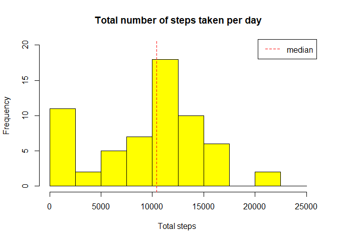
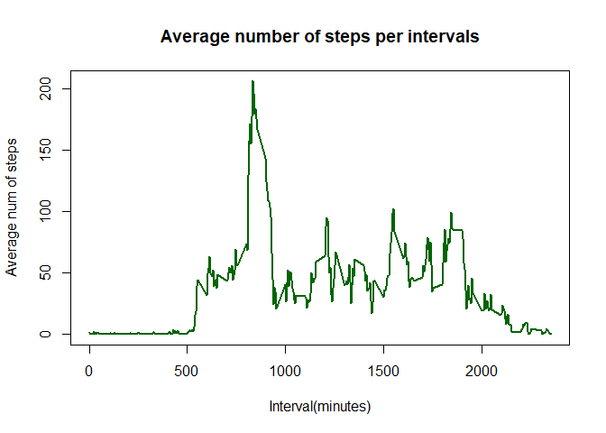
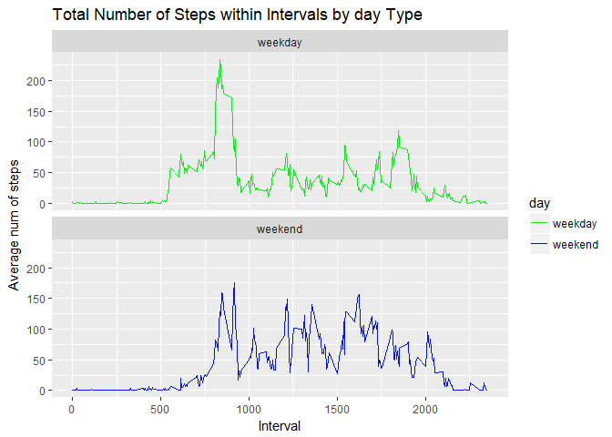

# Analyzing Fitbit Data(Reproducible Research: Peer Assessment 1)


## Loading and preprocessing the data

Unzip and read activity.csv file


```r
unzip("activity.zip") 

activityData <-read.csv("activity.csv")
```

Reading the data into activity data frame and show some summary statistics


```r
str(activityData)
```

```
## 'data.frame':	17568 obs. of  3 variables:
##  $ steps   : int  NA NA NA NA NA NA NA NA NA NA ...
##  $ date    : Factor w/ 61 levels "2012-10-01","2012-10-02",..: 1 1 1 1 1 1 1 1 1 1 ...
##  $ interval: int  0 5 10 15 20 25 30 35 40 45 ...
```

```r
summary(activityData)
```

```
##      steps                date          interval     
##  Min.   :  0.00   2012-10-01:  288   Min.   :   0.0  
##  1st Qu.:  0.00   2012-10-02:  288   1st Qu.: 588.8  
##  Median :  0.00   2012-10-03:  288   Median :1177.5  
##  Mean   : 37.38   2012-10-04:  288   Mean   :1177.5  
##  3rd Qu.: 12.00   2012-10-05:  288   3rd Qu.:1766.2  
##  Max.   :806.00   2012-10-06:  288   Max.   :2355.0  
##  NA's   :2304     (Other)   :15840
```

## What is mean total number of steps taken per day?

###Calculate the total number of steps taken per day

For this part of the assignment, you can ignore the missing values in the dataset.


```r
totalStepsPerDay <- with(activityData, aggregate(steps, by = list(date), FUN = sum, na.rm = TRUE))
names(totalStepsPerDay) <- c("date", "steps")
totalStepsPerDay
```

```
##          date steps
## 1  2012-10-01     0
## 2  2012-10-02   126
## 3  2012-10-03 11352
## 4  2012-10-04 12116
## 5  2012-10-05 13294
## 6  2012-10-06 15420
## 7  2012-10-07 11015
## 8  2012-10-08     0
## 9  2012-10-09 12811
## 10 2012-10-10  9900
## 11 2012-10-11 10304
## 12 2012-10-12 17382
## 13 2012-10-13 12426
## 14 2012-10-14 15098
## 15 2012-10-15 10139
## 16 2012-10-16 15084
## 17 2012-10-17 13452
## 18 2012-10-18 10056
## 19 2012-10-19 11829
## 20 2012-10-20 10395
## 21 2012-10-21  8821
## 22 2012-10-22 13460
## 23 2012-10-23  8918
## 24 2012-10-24  8355
## 25 2012-10-25  2492
## 26 2012-10-26  6778
## 27 2012-10-27 10119
## 28 2012-10-28 11458
## 29 2012-10-29  5018
## 30 2012-10-30  9819
## 31 2012-10-31 15414
## 32 2012-11-01     0
## 33 2012-11-02 10600
## 34 2012-11-03 10571
## 35 2012-11-04     0
## 36 2012-11-05 10439
## 37 2012-11-06  8334
## 38 2012-11-07 12883
## 39 2012-11-08  3219
## 40 2012-11-09     0
## 41 2012-11-10     0
## 42 2012-11-11 12608
## 43 2012-11-12 10765
## 44 2012-11-13  7336
## 45 2012-11-14     0
## 46 2012-11-15    41
## 47 2012-11-16  5441
## 48 2012-11-17 14339
## 49 2012-11-18 15110
## 50 2012-11-19  8841
## 51 2012-11-20  4472
## 52 2012-11-21 12787
## 53 2012-11-22 20427
## 54 2012-11-23 21194
## 55 2012-11-24 14478
## 56 2012-11-25 11834
## 57 2012-11-26 11162
## 58 2012-11-27 13646
## 59 2012-11-28 10183
## 60 2012-11-29  7047
## 61 2012-11-30     0
```

###Histogram of the total number of steps taken each day

Make a histogram of the total number of steps taken each day

```r
hist(totalStepsPerDay$steps, main = "Total number of steps taken per day", xlab = "Total steps ", col = "yellow", ylim = c(0,20), breaks = seq(0,25000, by=2500))
abline(v=median(totalStepsPerDay$steps),lty=2, lwd=1, col="red")
legend(legend="median","topright",lty=2,lwd=1,col="red")
```

<!-- -->


###Calculate and report the mean and median of the total number of steps taken per day


```r
meanSteps<- mean(totalStepsPerDay$steps)
meanSteps
```

```
## [1] 9354.23
```


```r
medianSteps<-median(totalStepsPerDay$steps)
medianSteps
```

```
## [1] 10395
```


## What is the average daily activity pattern?

###Make a time series plot (i.e. type = "l") of the 5-minute interval (x-axis) and the average number of steps taken, averaged across all days (y-axis)


```r
dailyActivityPattern <- aggregate(activityData$steps, by=list(activityData$interval), FUN=mean, na.rm=TRUE)

names(dailyActivityPattern) <- c("interval", "mean")

plot(dailyActivityPattern$interval, dailyActivityPattern$mean, type = "l", col="darkgreen", lwd = 2, xlab="Interval(minutes)", ylab="Average num of steps", main="Average number of steps per intervals")
```

<!-- -->


###Which 5-minute interval, on average across all the days in the dataset, contains the maximum number of steps?


```r
dailyActivityPattern[which.max(dailyActivityPattern$mean), ]$interval
```

```
## [1] 835
```

## Imputing missing values

###Calculate and report the total number of missing values in the dataset (i.e. the total number of rows with NAs)


```r
NA_data<- sum(is.na(activityData))

NA_data
```

```
## [1] 2304
```

###Devise a strategy for filling in all of the missing values in the dataset. The strategy does not need to be sophisticated. For example, you could use the mean/median for that day, or the mean for that 5-minute interval, etc.

I am going to substitute each NA with a fixed value. I will fill in all of the missing values in the dataset by the mean number of steps per interval.

###Create a new dataset that is equal to the original dataset but with the missing data filled in.


```r
meanSteps<- mean(totalStepsPerDay$steps)

activityDataFill<-activityData

activityDataFill[NA_data,"steps"]<-meanSteps

str(activityDataFill)
```

```
## 'data.frame':	17568 obs. of  3 variables:
##  $ steps   : num  NA NA NA NA NA NA NA NA NA NA ...
##  $ date    : Factor w/ 61 levels "2012-10-01","2012-10-02",..: 1 1 1 1 1 1 1 1 1 1 ...
##  $ interval: int  0 5 10 15 20 25 30 35 40 45 ...
```

###Make a histogram of the total number of steps taken each day and Calculate and report the mean and median total number of steps taken per day. Do these values differ from the estimates from the first part of the assignment? What is the impact of imputing missing data on the estimates of the total daily number of steps?


```r
totalStepsPerDayFIll <- aggregate(steps~date, activityDataFill,sum)


hist(totalStepsPerDayFIll$steps, main = "Number of Steps taken each day after NAs values are filled", xlab = "Total steps ", col = "red", ylim = c(0,30), breaks = seq(0,25000, by=2500))
abline(v=median(totalStepsPerDayFIll$steps),lty=2, lwd=1, col="yellow")
legend(legend="median","topright",lty=2,lwd=1,col="yellow")
```

<!-- -->
 
New mean of the total number of steps taken per day after NAs filled:


```r
meanAfterFill<-mean(totalStepsPerDayFIll$steps)
meanAfterFill
```

```
## [1] 10740.04
```

New median of the total number of steps taken per day after NAs filled:


```r
medianAfterFill<-median(totalStepsPerDayFIll$steps)
medianAfterFill
```

```
## [1] 10682.5
```

## Are there differences in activity patterns between weekdays and weekends?

###Create a new factor variable in the dataset with two levels - "weekday" and "weekend" indicating whether a given date is a weekday or weekend day.


```r
mingguKerjaCuti <- function(date) {
  hari <- weekdays(date)
  if (hari %in% c("Monday", "Tuesday", "Wednesday", "Thursday", "Friday"))
    return("weekday")
  else (hari %in% c("Saturday", "Sunday"))
    return("weekend")
}

activityData$date <- as.Date(activityData$date)
activityData$day <- sapply(activityData$date, FUN=mingguKerjaCuti)
```


###Make a panel plot containing a time series plot (i.e. type = "l") of the 5-minute interval (x-axis) and the average number of steps taken, averaged across all weekday days or weekend days (y-axis). See the README file in the GitHub repository to see an example of what this plot should look like using simulated data.


```r
library(ggplot2)
```

```
## Warning: package 'ggplot2' was built under R version 3.3.2
```

```r
purataActivity <- aggregate(steps ~ interval + day, data=activityData, mean)


plot<- ggplot(purataActivity, aes(x = interval , y = steps, color = day)) +
       geom_line() +
       labs(title = "Total Number of Steps within Intervals by day Type", x = "Interval", y = "Average num of steps") +
       scale_color_manual(values=c("#00F00F", "#000FFF"))+
       facet_wrap(~day, ncol = 1, nrow=2)
print(plot)
```

<!-- -->

